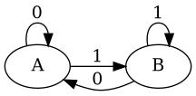

## The goal, type correct state machines

OCaml has great type inference and functions permeate the language. Coupling
these, how do we design not only a type safe mechanism for state machines but a
type correct one?

### Type correct, what?

Type safety gives us things like exhaustive matching on variants but I want a
way of preventing certain transitions in a state machine at the type level so
our machine can be (more) statically correct.

## The example state machine

We have two states: `A` and `B`, and two inputs `0` and `1`.

The machine is as follows:



Or in table form:

| From \\ To | A   | B   |
| ---------- | --- | --- |
| A          | 0   | 1   |
| B          | 0   | 1   |

## Attempt one, variants

Variants, or algebraic datatypes, give us nice ways of doing enumerations at
the type level which can be `match`ed on, perfect for limited sets of states
and inputs.

```ocaml
type state = A | B

type input = Zero | One

(* state *)
let initial = A

(* state -> input -> state *)
let transition s i =
  match (s, i) with
  | A, Zero -> A
  | A, One -> B
  | B, Zero -> A
  | B, One -> B
```

This gives us a complete implementation with an exhaustively checked `match`
statement in the `transitions` function. This is useful as it specifies the
transitions but requires us to look into the code to see what transitions are
possible from a given state so this isn't typey enough for me.

## Attempt two, polymorphic Variants

Polymorphic variants, super powered variants (kinda), allow us to have
enumerations of states but can appear in type signatures as their individual
_atoms_.

```ocaml
type state = [ `A | `B ]

type input = [ `Zero | `One ]

(* [> `A ] *)
let initial = `A

(* [< `A | `B ] -> [< `One | `Zero ] -> [> `A | `B ] *)
let transition s i =
  match (s, i) with
  | `A, `Zero -> `A
  | `A, `One -> `B
  | `B, `Zero -> `A
  | `B, `One -> `B
```

This may seem like I've just added backticks before the names of our states and
inputs (and that is what I did) but we also gained some different type
signatures, look at `initial` for instance, which will lead us to attempt
three.

## Attempt three, transition functions

From attempt two we could see that our states and inputs are split up in the
type system. How about we make that more useful?

```ocaml
type state = [ `A | `B ]

(* [> `A ] *)
let initial = `A

(* [< `A | `B ] -> [> `A ] *)
let zero = function `A | `B -> `A

(* [< `A | `B ] -> [> `B ] *)
let one = function `A | `B -> `B

(* [< `One | `Zero ] -> [< `A | `B ] -> [> `A | `B ] *)
let input_to_function = function `Zero -> zero | `One -> one

(*  [< `A | `B ] -> [< `One | `Zero ] -> [> `A | `B ] *)
let transition s = function `Zero -> zero s | `One -> one s
```

This allows us to now create functions representing the transitions for a given
input and the type signatures show us the possible next states. The typical
`transition` function can also be constructed from this to fold over inputs.

I like this last attempt due to the explicitness of the transition functions
and the fact that it extends to state machines where not all states may accept
all inputs. Particularly useful for modelling protocols which may have short
circuiting for errors or unique inputs for a subset of states.
