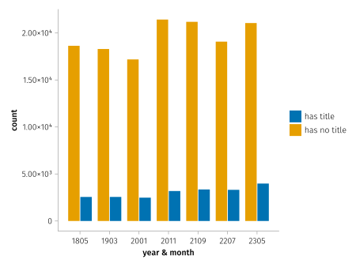
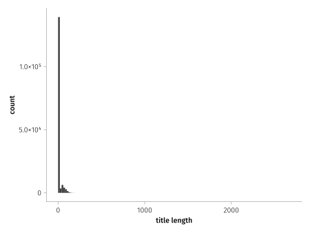
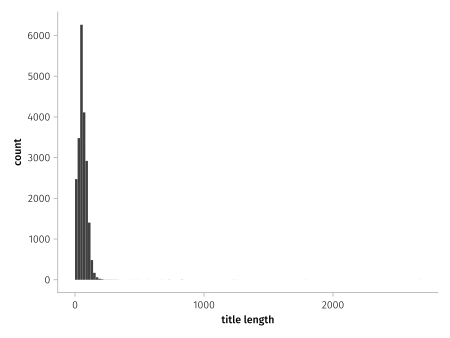
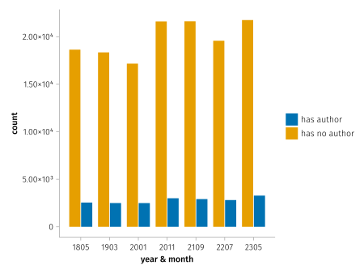
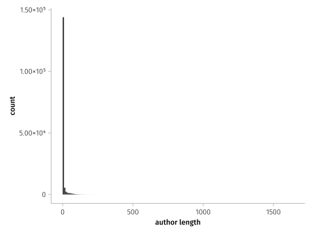
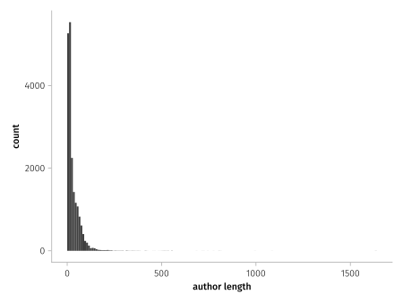

## The background

Metadata is commonly used for providing additional information in files that is typically also readable by computer programs.
It can be very useful for automated extraction of things, such as the now popular machine learning, if for some reason you wanted to train a model to predict the next title based on your favourite papers locally.
But I don't want to do that, at least not yet.
I just want to have a tool that knows how to read a PDF file's metadata and use some of that data for keeping track of my paper collection.
Seems simple: files include metadata, machines can extract that data, and I can write some glue code.

But the problem is, not all files include the metadata.

I can understand not all people bother to include metadata fields for quick things they put into a PDF, but for things such as published academic papers I would hope otherwise, with more care taken.
To me, it is a mark of care.
(Though I'm probably already guilty of going against this myself).

Sure, there are automated tools for trying to extract common pieces of metadata from the main content of files but I don't want some heuristic things, I want what the author put the title as, or their own names.
Conveniently, these academic papers are uploaded to repositories that **require** them to input basic information such as the title and authors of the paper.
Because the platforms have the data themselves, they could easily add it to the PDF file if it doesn't already exist.
Now, I don't have any particular influence over these repositories, and I can understand them wanting to not interfere with the built artifacts (for reproducibility or otherwise), so we can switch back to the original authors...

Rather than just speaking from my experience of downloading papers, I thought I'd try and have a look at some data.
ArXiv is a popular repository for papers in my field, particularly because it is open-access.
They handily publish archives of their PDFs, grouped by the year and month they were submitted, so we can play around with some of that.
That also happens to be a lot of papers, so I've just selected a few `yearmonth`s and worked with those.
You can find the scripts for processing, if you want to try with more data for instance, on my GitHub: [github.com/jeffa5/arxiv-pdf-meta](https://github.com/jeffa5/arxiv-pdf-meta).

## The data

### Titles

So, lets start with how many papers had a title specified in the metadata:

Well, that isn't too promising.
It doesn't seem to be increasing much over the duration.

Might as well have a look at the distribution of the title lengths while we're here:

Oh, and yeah, lets remove the zero from that... (note the y-axis)

### Authors

Given the data for titles, I don't have much of an expectation that authors are specified in the metadata either:

About what we expected, how about the distribution of lengths?

And again without the 0 ones...

## Other oddities

So, there's some strong evidence for papers often not having sufficient simple metadata embedded in the PDF.
But, hold on, the length distributions look interesting, I'd expect the papers with a title to have one with reasonable length.

_what would a one letter title look like??_

Well, here you go

|title|count|
|-|-|
|`\uf020`|262|
|` `|20|
|`1`|10|
|`_`|10|
|`A`|8|

Yes, that is a space on the second row.
Maybe PDF parsing isn't completely accurate (given the unicode value) but that seems not too egregious.

Titles with 42 characters were actually the most common after those with 0, just under a thousand of them.
At least there are some reasonable length titles in there.
Though, looking at the most common titles, `Submitted to INTERSPEECH`, `Overleaf Example`, `A template for the arxiv style`, and simply `Title` are... interesting.

As for authors there are some better contenders at the low character count, but `-` (the most popular of length 1) doesn't seem right.
Some of the most popular authors are `Anonymous Submission`, `Author name(s) withheld`, `IEEE`, and `Author`, and `-` again.
